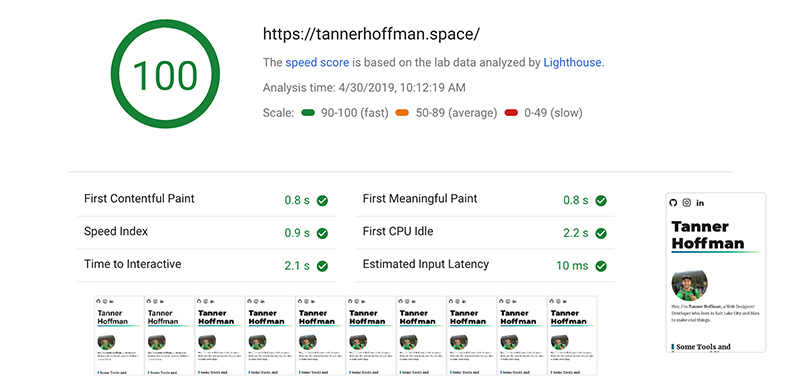

## Static Site Generator

If you're interested in JavaScript and modern JavaScript frameworks then you've probably heard of Gatsby. As stated on the official [Gatsby Website](https://www.gatsbyjs.org/), "Gatsby is a free and open source framework based on React that helps developers build blazing fast websites and apps". If you enjoy developing with React and GraphQL, then chances are you will love using Gatsby!

<blockquote cite="https://jamstack.org/">
The JAMstack is not about specific technologies. It’s a new way of building websites and apps that delivers better performance, higher security, lower cost of scaling, and a better developer experience.
</blockquote>

After playing around with Gatsby while on my pursuit of learning React and some GraphQL, I enjoyed it so much that I made the decision to use it to re-build my [portfolio website](https://www.tannerhoffman.space), **yes** the website you are on right now is built using Gatsby! The first thing I noticed when I started using Gatsby is how fast the loading speeds were, like they really aren't lying when they say *"Blazing Fast"*. In fact [Google Page Speed Insights](https://developers.google.com/speed/pagespeed/insights/) gave my website a perfect score of *100 out of 100* on both Mobile and Desktop speed tests.

Gatsby helps you get to the fun part of developing as fast as possible, by coming *pre packed* with all of the latest and most powerful Web technologies such as React, Webpack, GraphQL and much more - ready and configured for you to start building. Gatsby does a lot of work to help make your website fast, including **built in** code and data splitting, tools for image optimization, and more.

## Pull data from your favorite places

One of the coolest parts about using Gatsby is that there are tons of plugins that let you bring data into your website from one or more sources. You can bring in data from a headless CMS, database, your file system, and more by inserting data straight into your pages using GraphQL. If you want to create content on a CMS such as WordPress, using a Gatsby Source Plugin makes it super easy to query all of your posts and pages and will automatically create pages for your static site.

#### Some of the many plugins Gatsby has to offer
- [gatsby-source-wordpress
](https://www.gatsbyjs.org/packages/gatsby-source-wordpress/?=wor#gatsby-source-wordpress)
- [gatsby-plugin-sass
](https://www.gatsbyjs.org/packages/gatsby-plugin-sass/?=)
- [gatsby-plugin-page-creator](https://www.gatsbyjs.org/packages/gatsby-plugin-page-creator/?=)
- [gatsby-plugin-react-helmet](https://www.gatsbyjs.org/packages/gatsby-plugin-react-helmet/?=)
- [gatsby-image](https://www.gatsbyjs.org/packages/gatsby-image/?=#gatsby-image)
